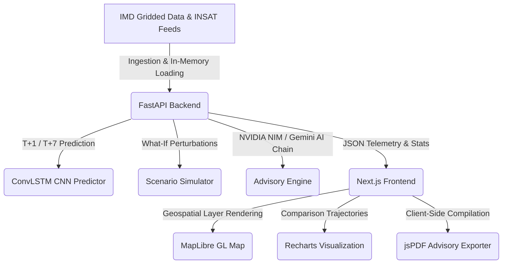

# VAYU-DRISHTI // Climate Digital Twin OS

**VAYU-DRISHTI** (meaning *"Vision of the Atmosphere"* or *"Insight into Air/Climate"*) is a high-fidelity, deep-tech AI digital twin of India's climate system. The platform combines real-time satellite calibration models, gridded historical ground records from the India Meteorological Department (IMD), and convolutional LSTM neural networks (ConvLSTM) to visualize, predict, and simulate atmospheric and surface trajectories.

---

## 🏗️ Architecture Overview

The project is structured into two main components:
```
VATU-DRIDHTI_ISRO/
├── backend/          # FastAPI server, ML models, and NetCDF data parsing
├── frontend/         # Next.js 15, Recharts, and MapLibre GL geospatial map
└── data/             # Historical weather records (.npy matrices, raw .nc NetCDF)
```



---

## ⚡ Core Capabilities

### 1. Interactive Geospatial Dashboard
*   **31×31 High-Resolution Grid**: Models weather profiles spanning coordinates from $8.0^\circ\text{N}$ to $37.0^\circ\text{N}$ and $68.0^\circ\text{E}$ to $97.0^\circ\text{E}$.
*   **Variable Layer Toggles**: Visualize Temperature (`°C`), Precipitation (`mm`), and Risk Alerts (`LOW`, `WARNING`, `CRITICAL`) using MapLibre GL.
*   **Temporal Scrubbing**: Move through history (`T-5` days) and predict future outcomes (`T+30` days) using the temporal playback bar.

### 2. INSAT Satellite Data Layer
*   **Satellite Network Overlays**: Calibrates and contrasts IMD Ground Observation metrics with satellite-sensor models simulating INSAT-3D/3DR feeds.
*   **Interactive Active Bands Legend**: Details specific spectral sensor profiles:
    *   **LST** (Land Surface Skin Temperature) — models diurnal skin heat shifts ($+3.4^\circ\text{C}$).
    *   **SST** (Sea Surface Temperature) — tracks oceanic thermal inertia buffers ($-1.2^\circ\text{C}$).
    *   **3RIMG** (Microwave Rain Composite) — cloud-top microwave precipitation proxy estimation.
*   **INSAT Sensor Diff Table**: Side-by-side comparative metadata displayed directly in the grid readout panel when Satellite Mode is active.

### 3. What-If Scenario Simulator
*   **Manual Perturbation Sliders**: Induce custom Temperature deltas ($\pm 5.0^\circ\text{C}$) and Precipitation offsets ($\pm 10.0\text{ mm}$).
*   **Extreme Condition Matrices**: Activate Drought presets (reducing moisture by $60\%$) or Flood scenario matrix overlays (forcing heavy runoff indexes).
*   **Split Comparison Trajectory Charts**: Recharts-powered graphs comparing baseline metrics against simulated What-If trajectories in real time.

### 4. Agricultural & Disaster Advisory Exporter (PDF)
*   **Live Risk Advisory Compiler**: Queries the backend `/api/advisory` endpoint to generate structured guidelines for local policy coordinators.
*   **Government-Style PDF Document**: Exports clean A4 advisories containing coordinates, active sensor records, risk pills, snapshot tables, and 6 sections of AI-generated advisory advice:
    1. Executive Summary
    2. Telemetry Snapshot Analysis
    3. Agricultural Risk Assessment
    4. Disaster Management Advisory
    5. 7-Day Outlook (ConvLSTM Forecast)
    6. Recommended Actions

---

## 📡 API Directory

The FastAPI backend exposes the following REST endpoints under `/api`:

| Method | Endpoint | Query Parameters | Description |
| :--- | :--- | :--- | :--- |
| `GET` | `/api/data` | `day_offset`, `source`, `sensor_type` | Returns India's $31\times31$ climate grid telemetry. |
| `GET` | `/api/predict` | None | Returns baseline summaries and predictions at $T+1$, $T+7$, and $T+30$. |
| `GET` | `/api/simulate` | `temp_delta`, `rain_delta`, `drought_mode`, `flood_mode`, `sensor_type` | Computes simulated What-If climate grids. |
| `POST` | `/api/chat` | `message`, `history`, `selected_cell`, `sensor_type` | Feeds conversation turns to NVIDIA NIM/Gemini AI Copilot. |
| `GET` | `/api/advisory` | `lat`, `lon`, `temp`, `rain`, `humidity`, `risk_zone`, `sensor_type` | Builds structured advisory JSON sections for PDF compilation. |

---

## 🛠️ Installation & Server Setup

### Prerequisites
*   Python 3.10+
*   Node.js 18+

### Setup Steps

1. **Clone the repository and go to workspace root**:
   ```bash
   cd VATU-DRIDHTI_ISRO
   ```

2. **Configure API Keys (Optional but recommended for AI Copilot)**:
   Create or edit the file `backend/.env`:
   ```env
   # NVIDIA NIM API Key (Nemotron Model)
   NVIDIA_API_KEY=your_nvidia_api_key_here
   
   # Optional fallback
   GEMINI_API_KEY=your_gemini_api_key_here
   ```

3. **Install dependencies & start Backend (FastAPI)**:
   ```bash
   cd backend
   pip install -r requirements.txt
   uvicorn app.main:app --reload --port 8000
   ```

4. **Install dependencies & start Frontend (Next.js)**:
   ```bash
   cd ../frontend
   npm install
   npm run dev
   ```

5. **Access VAYU-DRISHTI**:
   Open your browser and navigate to **`http://localhost:3000`** (or dashboard at `http://localhost:3000/dashboard`).

---

## 🧪 Testing

To execute the backend testing suite, run `pytest` in the backend directory:
```bash
cd backend
pytest
```
*Visual and layout compilation has been compiled and validated locally under Next.js Turbopack with 0 type-checking errors.*
